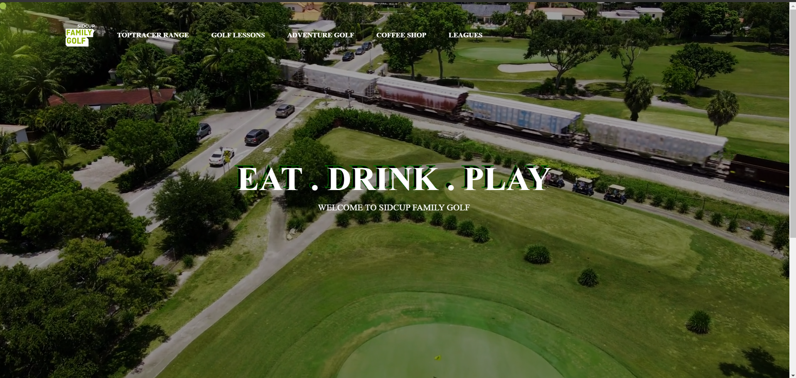

# Sidcup Family Golf

Welcome to the **Sidcup Family Golf** website! ⛳ This project is a frontend user interface (UI) designed for a family-friendly golf experience. It showcases information about the golf facility, its features, and provides an interactive and visually appealing experience for visitors. The website is built using **HTML**, **CSS**, and **JavaScript**.

## 🚀 Demo

You can visit the live version of the website here: [Sidcup Family Golf](https://prernakansal287.github.io/Sidcup-family-golf/)

## 🛠️ Technologies Used

- **HTML**: Structure of the website.
- **CSS**: Styling and layout for a responsive and user-friendly design.
- **JavaScript**: Adding interactivity and dynamic features.

## 📑 Features

- **Responsive Design**: The website is fully responsive and adapts to various screen sizes, providing a seamless experience on both desktop and mobile devices.
- **Interactive UI**: Includes dynamic elements and animations using JavaScript.
